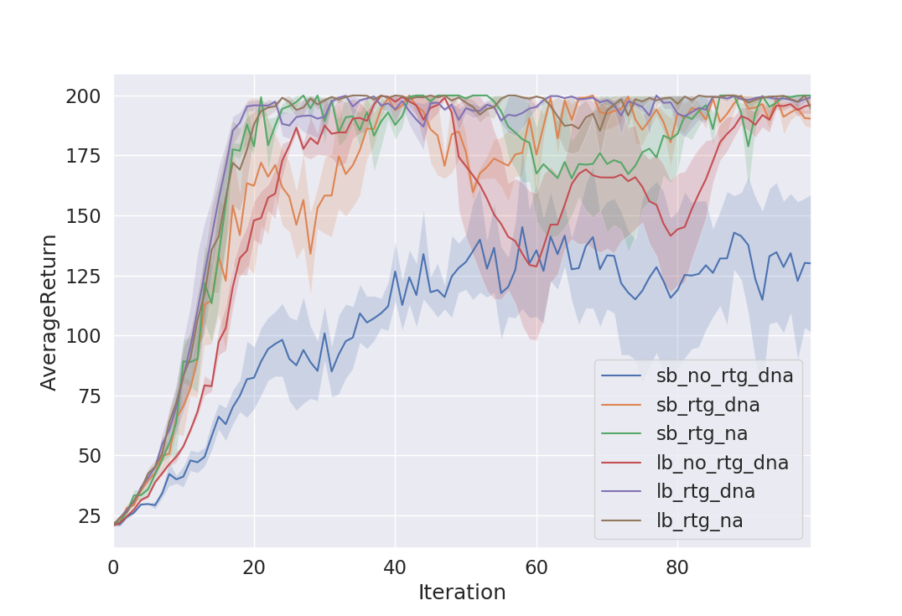
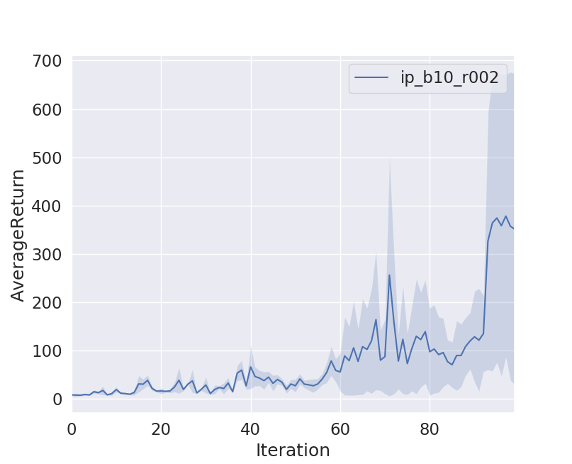
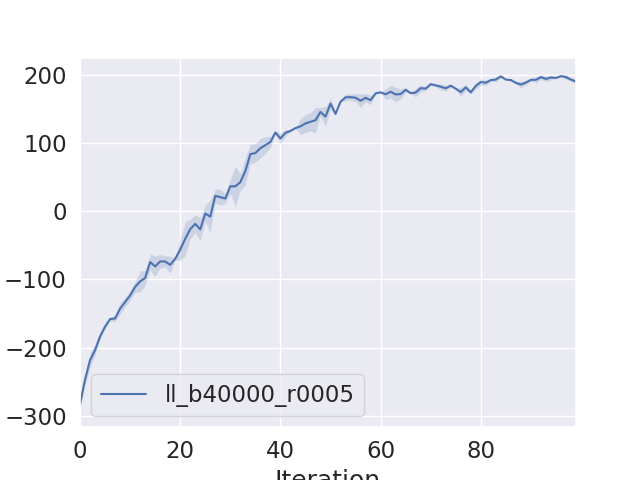
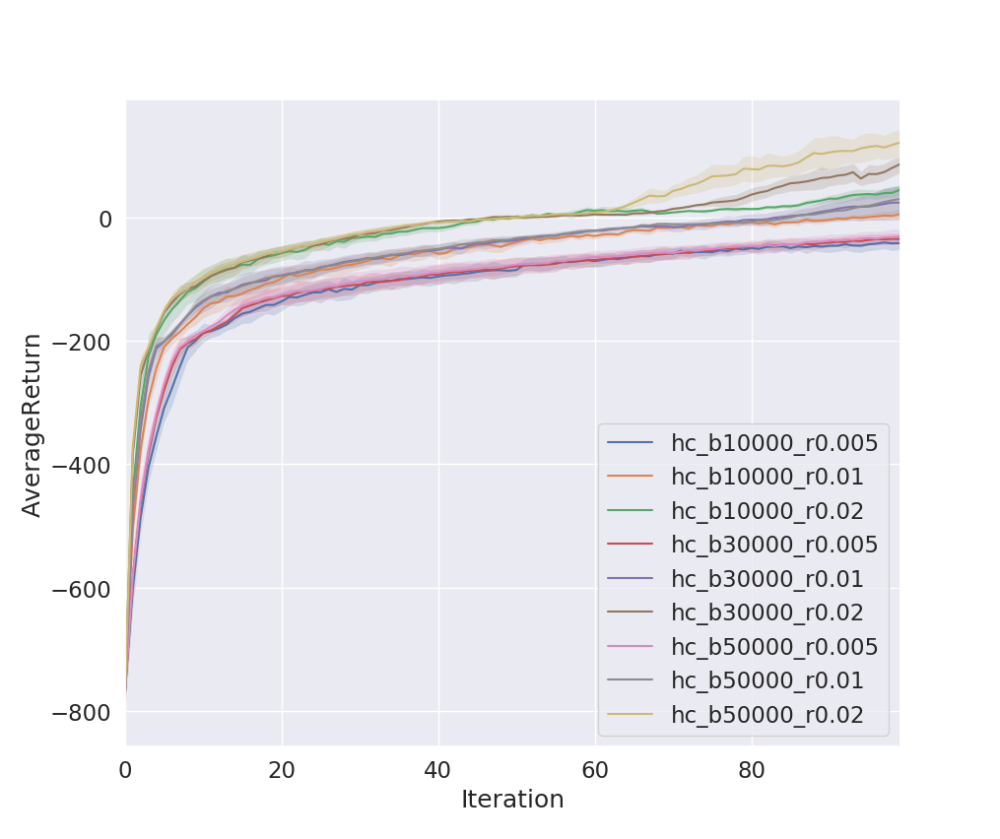
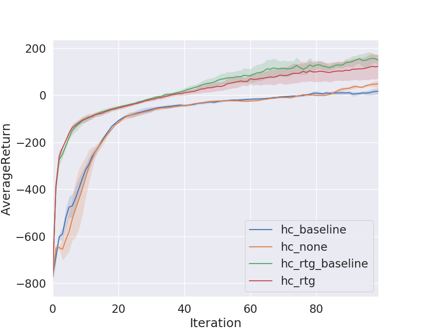

# CS294-112 HW 2: Policy Gradient

## Problem 1

Check my [blog](https://yongjin-shin.github.io/rl/Berkeley-CS294-HW2/)

## Problem 2 ~ 7

These are the results of several experiments and the note about what I was struggling.

### First, Struggling points. 

1. Build_mlp: keep in mind that the number of hidden layers doesn't contain input and output layers.
2. Placeholder: Do not use zero initializer! Upon my experiment, zero initializer makes better performance however it doesn't guarantee any generality over the model .
3. Get_log_prob: 
   1. If one uses (sparse)softmax cross entropy, be cautious about the output value of network. Since categorical distriubtion can accept both probability and logit, it is okay as far as we can be sure that probability value should be between 0 and 1. However for softmax cross entropy, Never use Softmax activation on the last layer of network. This function only take unscaled value!
   2. I am not sure why distribution.Normal have different results from the full expression of normal distribution.
4. Sum_of_Rewards: Be CAUTIOUS!!!! Since I didn't notice that my code did not represent 'reward to go' well, my model was not trained fast (but interestingly it showed the proper performance a lot later...)
5. Baseline: baseline(value function)  doesn't need to scale explicitly to be standardized. In the loss function, anywasy we will make our target to be standardized. Otherwise, the model performance is slightly worse.
6. General:
   1. Try to use variable_scop for checking the graph
   2. Practicing to use tf.squeeze

### Results

1. Small batch vs Large bach: Large batch is much better! (though takes longer)

2. Reward to go: Much better performance for any batch sizes! And smaller variance.

3. Standardization: Much smaller variance for any batch size!
   

4. I don't want to test it again but if I use seed number 1, the model touch 1,000 before 100 iteration.
   

5. Yay!
   

6. Large Batch and Big step size is the best. The thing is that unlike (un)supervised learning, step size might not the first parameter to consider when the performance is not very good, rather considering bigger batch size may be a better idea.
   

7. Obviously using baseline(value function) shows smaller variance. 'Reward to go' make better performance, however it shows bigger variance. This is weird. Basically 'Reward to go' is the remedy for reducing variance...WEIRD!!!
   

   